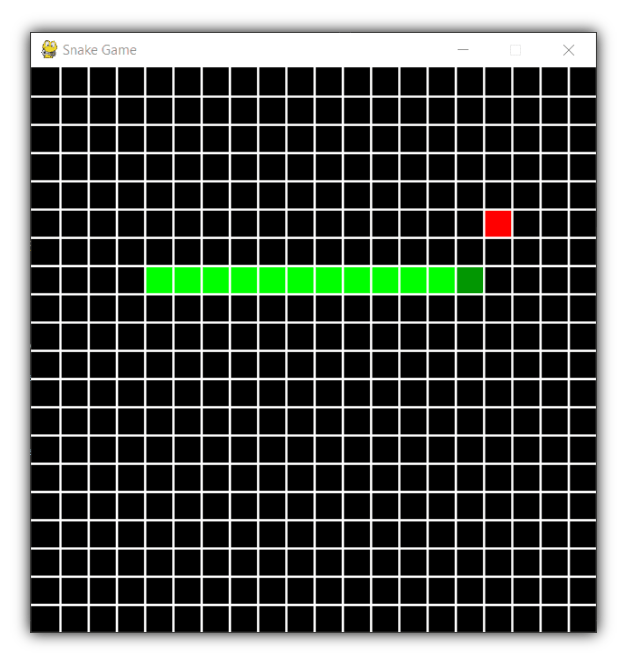

# Snake game

Game where player controls snake which roams around on a bordered plane, picking up food, trying to avoid hitting its own tail or the edges of the playing area. Each time the snake eats a piece of food, its tail grows longer, making the game increasingly difficult. 


## Requirements

- python v3.5+
- python modules
  - pygame v2.1.0+
  - tkinter v8.6+

## Usage

To start the game
```bash
python3 main.py
```

## Screenshots

<p align="center">

</p>

## Controls

The user can controls the direction of the snake's head (up, down, left, or right) using left and right keyboard buttons, and the snake's body follows.